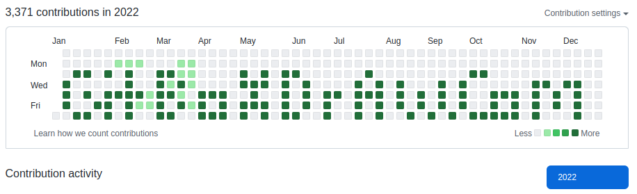
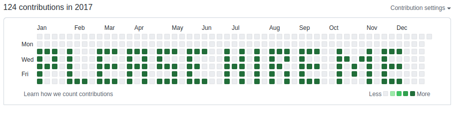

# GitBoxDraw.com

\
\
[GitBoxDraw.com](https://gitboxdraw.com) is a tool that allows users to make art with their git commit graphs on their Github profile.
\
\
It works by allowing users to select a desired year and dates with mouse clicks, then
generates a bash script that they can execute to quickly generate the desired commits on those dates.
\
\
Users can also use the tool to generate multiple commits for each day, so that those days are shaded using darker color within their Github, which makes their art "pop" relative to their lighter-shaded regular commits.
\
\
The code I wrote for this tool was **previously in a private repository**, but can now be found here in this repository. The **live version on [GitBoxDraw.com](https://gitboxdraw.com) is still obfuscated, although technically it no longer needs to be now that the code is public**.

## Example

**1)** &nbsp;&nbsp;&nbsp; A live example that says *Please Hire Me* can be seen here:
\
\
[https://github.com/sunspla-sh?tab=overview&from=2017-12-01&to=2017-12-31](https://github.com/sunspla-sh?tab=overview&from=2017-12-01&to=2017-12-31)
